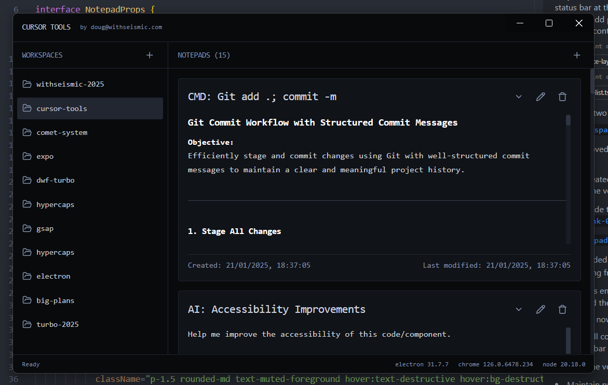

[](https://opensource.org/licenses/MIT)
[](https://github.com/withseismic/cursor-tools/stargazers)
[](https://www.typescriptlang.org/)
[](https://www.electronjs.org/)
[](https://reactjs.org/)
[](https://discord.gg/cursor)

[🔗 Reddit Discussion](https://www.reddit.com/r/cursor/comments/1i77m4d/notepads_manager_for_cursor/) | [💬 Discord Community](https://discord.gg/BX25FcS53N)

# Cursor Tools

A powerful desktop application for managing and enhancing your Cursor IDE notepads, built with Electron, React, and TypeScript. (Ish. It's a proof of concept that shows you how to hook into Cursor's workspace / global settings and do some cool stuff.)



## Overview

Cursor Tools provides a robust suite of utilities for managing your Cursor IDE notepads, allowing you to backup, sync, and organize your development notes across workspaces. Built with modern technologies and best practices, it offers a seamless integration with your Cursor IDE workflow.

### Key Features

#### 1. Notepad Management

- **Create & Edit**: Create new notepads with rich content and edit existing ones
- **Organization**: Group related notepads and manage them efficiently
- **Search & Filter**: Quickly find notepads across all workspaces
- **Backup & Sync**: Automatically backup your Cursor notepads across workspaces
- **Import/Export**: Share notepads between workspaces or with team members

#### 2. Smart Templates

Pre-built notepad templates for common development workflows:

- Git branch and workflow best practices
- Test-Driven Development (TDD) guides
- AI-assisted development patterns
- Documentation templates
- Code review checklists
- Performance optimization guides
- Security best practices
- Accessibility guidelines
- Architecture planning templates

#### 3. Workspace Integration

- **Multi-Workspace Support**: Manage notepads across multiple Cursor workspaces
- **Workspace Migration**: Easily copy notepads between workspaces
- **Context Awareness**: Notepads maintain references to relevant files and folders
- **Persistent Storage**: Reliable SQLite-based storage for all your notes

#### 4. Advanced Features

- **Version History**: Track changes to your notepads over time
- **Rich Context**: Link notepads to files, folders, and git commits
- **Smart References**: Maintain connections to external resources and documentation
- **Customizable Layout**: Adjust the UI layout to match your workflow

### Installation

```bash
# Install dependencies
pnpm install

# Start development
pnpm dev:electron

# Build for your platform
pnpm build:win    # Windows
pnpm build:mac    # macOS
pnpm build:linux  # Linux
```

### Project Structure

This project uses [Turborepo](https://turbo.build/repo) and follows modern development practices:

```
apps/
  ├── electron-app/        # Main desktop application
  │   ├── src/
  │   │   ├── main/       # Electron main process
  │   │   ├── renderer/   # React-based UI
  │   │   └── preload/    # Preload scripts
  │   └── ...
packages/
  ├── eslint-config/      # Shared ESLint configuration
  └── typescript-config/  # Shared TypeScript configuration
```

### Technology Stack

- **TypeScript**: For type-safe code
- **Electron**: Desktop application framework
- **React**: UI components and state management
- **SQLite**: Reliable data persistence
- **Tailwind CSS**: Modern styling
- **ESLint & Prettier**: Code quality tools

### API Documentation

#### Notepad Management

```typescript
// Create a new notepad
const notepad = await notepadManager.createNotepad({
  name: "My Notepad",
  text: "Initial content"
});

// Get all notepads
const notepads = await notepadManager.getAll();

// Get a specific notepad
const notepad = await notepadManager.getNotepad(id);

// Update notepad content
await notepad.setText("Updated content");

// Delete a notepad
await notepadManager.deleteNotepad(id);
```

#### Workspace Operations

```typescript
// Get all workspaces
const workspaces = await workspaceManager.getWorkspaces();

// Get a specific workspace
const workspace = await workspaceManager.getWorkspace(id);

// Access workspace storage
await workspace.set("key", value);
const value = await workspace.get("key");
```

### Contributing

We welcome contributions! Please follow these steps:

1. Fork the repository
2. Create a feature branch
3. Make your changes
4. Submit a pull request

Please ensure your code follows our style guidelines and includes appropriate tests.

### License

MIT
