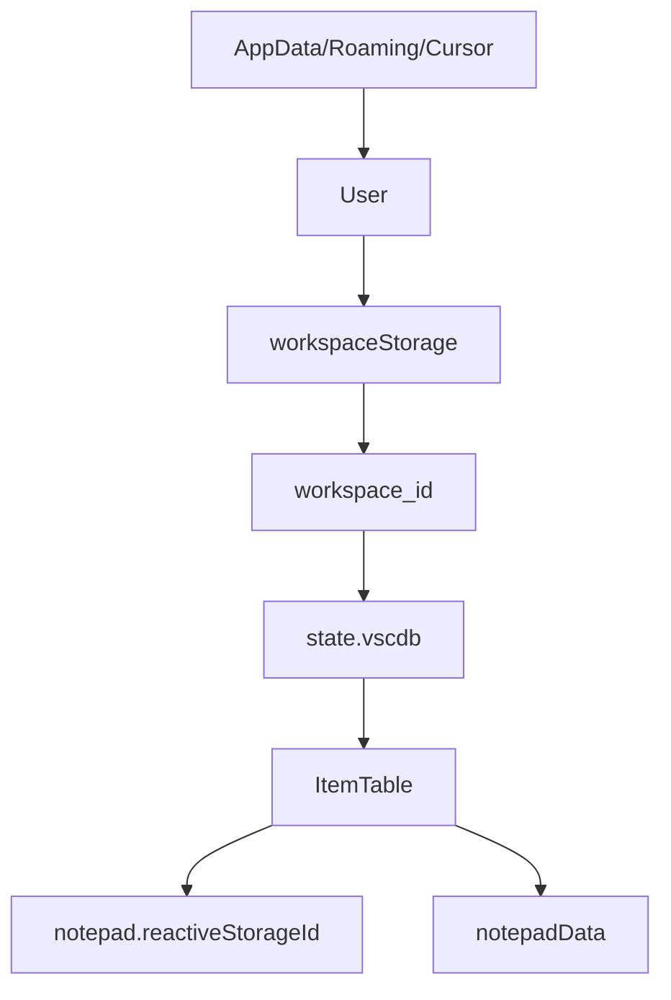
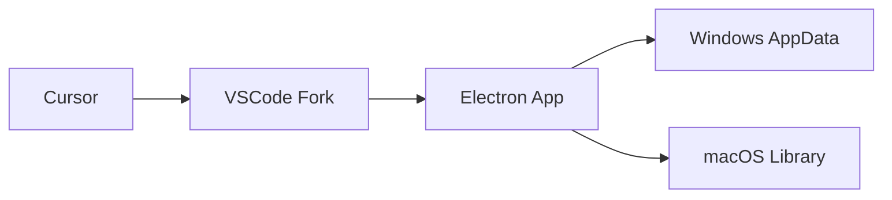
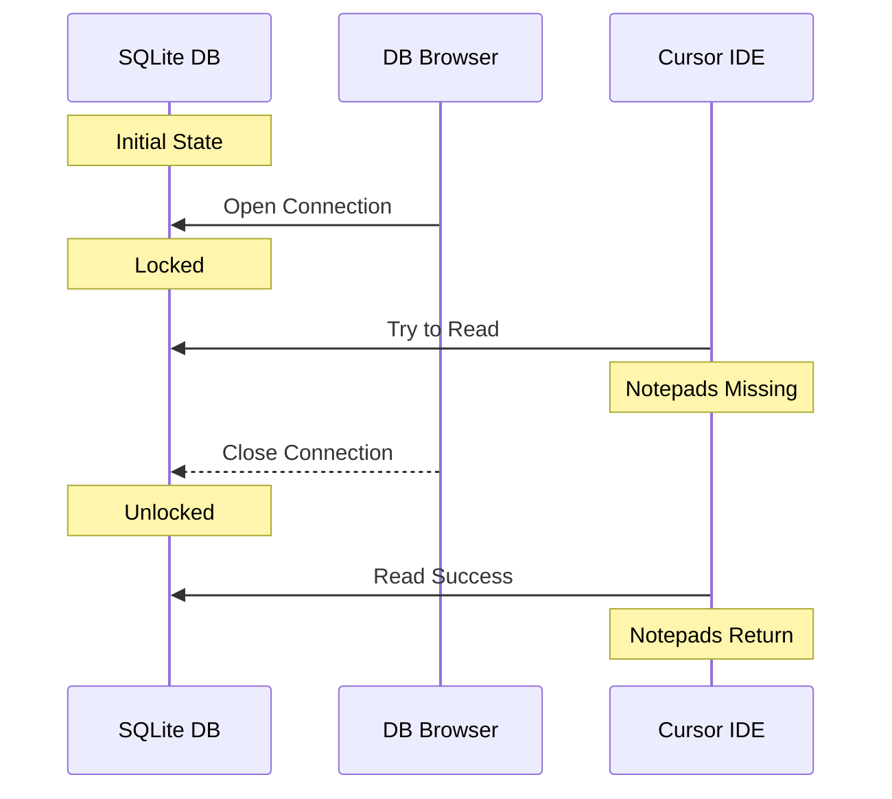

# Deep Dive: Hacking Cursor's Notepad System

> A technical exploration of Cursor IDE's notepad storage system and how we built tools to enhance it.

## Table of Contents

- [Introduction](#introduction)
- [The Problem](#the-problem)
- [A Word on Problem-Solving](#a-word-on-problem-solving)
- [Understanding Cursor's Architecture](#understanding-cursors-architecture)
- [The Investigation](#the-investigation)
- [Technical Implementation](#technical-implementation)
- [Building the Solution](#building-the-solution)
- [Future Improvements](#future-improvements)

## Introduction

This isn't how I thought I'd spend my Tuesday morning, but after renaming a project folder and losing all my Cursor settings, here I am, making the system change instead of myself.

### What are Cursor Notepads?

Cursor Notepads are an incredible feature that enhance output quality and let you harness literal LLM magic. They're not just text files – they're interactive AI prompts, code snippets, and project documentation that evolve with your workflow. I rarely use the AI composer without one of my many notepad templates guiding the conversation.

But there's a catch: these powerful tools are locked to individual workspaces. Create a new project? Start from scratch. Rename a folder? Wave goodbye to your carefully crafted prompts. This isn't a great workflow, so I decided to change it.

## The Problem

It started with a simple folder rename. One morning, I opened my newly renamed project in Cursor IDE, and all my carefully crafted notepads were gone. Not just any notepads – these were my collection of AI prompts, code snippets, and project documentation that I'd been refining for weeks.

The original discussion on [Cursor's forum](https://forum.cursor.com/t/where-are-notepads-stored/18659/10) showed I wasn't alone. Many developers were looking for ways to back up and manage their notepads, but there were no solutions available.

## A Word on Problem-Solving

Like all the most engaging rabbit holes, this one started with a hunch. I knew I wanted to get at my Notepad data, but other than that, an internet search turned up pretty much zero. If you're coming to this article off the back of your own search, I hope it helps out.

When it comes to problem-solving, here's how my head normally works... very much like everyone else, but with the added benefit/hindrance of being zealously undeterred where others might give up. I am sunk cost fallacy manifest.

Much like good marketing, a good problem is a rare but powerful thought. A good problem:

- Sets the stage with just enough detail to nudge your thoughts in the right direction
- Lets your own inquisitive thoughts fill in the gaps
- Sees you, the protagonist, arrive at the gates of the dungeon, armed only with your knowledge, a poorly scribbled map from previous travelers, and a level one wooden sword

The most persuasive problems are the ones that get in your future self's head. They manifest themselves not just as a bug to crush or a decision to make, but as an opportunity that lights a fire under your ass to do the hard work.

As someone with an impossibly short attention span, no real direction outside "I enjoy building things", and an overindex of experience solving incredibly niche problems that nobody cares about - this is one of those problems.

## Understanding Cursor's Architecture

Cursor is built on VSCode's architecture, which means it's an Electron application. This gives us some immediate insights:

1. **Storage Location**: Like most Electron apps, user data is stored in the AppData directory:

   Windows:

   ```
   %AppData%/Roaming/Cursor/User/workspaceStorage/{workspace_id}/state.vscdb
   ```

   macOS:

   ```
   ~/Library/Application Support/Cursor/User/workspaceStorage/{workspace_id}/state.vscdb
   ```

2. **Data Structure**:
   - SQLite database (`state.vscdb`)
   - Two key tables: `ItemTable` and `cursorDiskKV`
   - Notepad data stored under two keys:
     - `notepad.reactiveStorageId`
     - `notepadData`



## The Investigation

### 1. Starting Knowledge

First, let's break down what we know about Cursor:



The key insights:

- Cursor is a VSCode fork
- VSCode is Electron-based
- Electron apps follow standard storage patterns
- Windows apps store user data in `%AppData%`

### 2. Initial Location Search

Armed with this knowledge, our first step was obvious:

```bash
# Windows
cd %AppData%/Roaming/Cursor/

# Look familiar? It should - it's identical to VSCode's structure
User/
├── globalStorage/     # Global application data
└── workspaceStorage/ # Per-workspace settings
    └── {uuid}/      # Individual workspace data
```

### 3. Data Discovery Process

This is where the real detective work began. Our process:

1. **Quick File Analysis**
   - Drop files into text editor
   - Scan JSON files (mostly configuration)
   - Check `.txt` files (logs and metadata)
   - Note any `.db` or `.sqlite` files

2. **Common Storage Patterns**

   ```bash
   # Look for database files
   find . -type f -name "*.db" -o -name "*.sqlite" -o -name "*.vscdb"
   
   # Check for JSON storage
   find . -type f -name "state.json" -o -name "storage.json"
   
   # Scan log files for clues
   find . -type f -name "*.log"
   ```

3. **Grep for Notepad References**

   ```bash
   grep -r "notepad" .
   ```

   Found references in:
   - Log files (view initialization)
   - Binary files (`.code` files)
   - SQLite databases

### 4. Database Investigation

The breakthrough came when we found `state.vscdb`:

```sql
-- First attempt: Look for notepad-related keys
SELECT * FROM ItemTable 
WHERE key LIKE '%notepad%';

-- Found our treasure:
-- 1. notepad.reactiveStorageId
-- 2. notepadData
```

### 5. The "Aha" Moment

Here's where it got interesting. After finding the data:

1. Made an edit to a notepad in the database
2. Opened Cursor... and all notepads disappeared
3. **Key Learning**: File permissions matter
   - Database locked by viewer
   - Cursor couldn't access it
   - Close viewer, notepads return



This investigation led to some important principles for our solution:

1. Always check file permissions
2. Implement proper database locking
3. Handle connection errors gracefully
4. Maintain backups (thank you, `.vscdb.backup`)

## Technical Implementation

### 1. Workspace Structure

```typescript
interface WorkspaceInfo {
  id: string;              // Workspace UUID
  folderPath: string;      // Absolute path
  dbPath: string;          // Path to state.vscdb
}
```

### 2. Notepad Data Model

```typescript
interface NotepadInfo {
  id: string;
  name: string;
  text: string;
  createdAt: number;
  context: NotepadContext;
  // ... additional metadata
}
```

### 3. Storage Access

```typescript
class Workspace {
  async get<T>(key: string): Promise<T | null> {
    // Access SQLite database
  }

  async set<T>(key: string, value: T): Promise<void> {
    // Update database
  }
}
```

## Building the Solution

### 1. Core Features

- Workspace detection and management
- SQLite database access
- Notepad CRUD operations
- Backup and restore functionality

### 2. Safety Considerations

- Automatic database backups
- File permission handling
- Cursor process detection

### 3. User Interface

```typescript
// Example: Creating a new notepad
const notepad = await notepadManager.createNotepad({
  name: "My Notepad",
  text: "Initial content"
});
```

## Future Improvements

1. **Cross-Platform Support**
   - macOS: `~/Library/Application Support/Cursor`
   - Linux: `~/.config/Cursor`

2. **Enhanced Features**
   - Template management
   - Cloud sync
   - Workspace migration tools

3. **Community Contributions**
   - Template sharing
   - Plugin system
   - Custom storage backends

## Resources

- [Original Forum Discussion](https://forum.cursor.com/t/where-are-notepads-stored/18659/10)
- [SQLite Documentation](https://www.sqlite.org/docs.html)
- [Electron Storage Best Practices](https://www.electronjs.org/docs/latest/api/app#appgetpathname)
