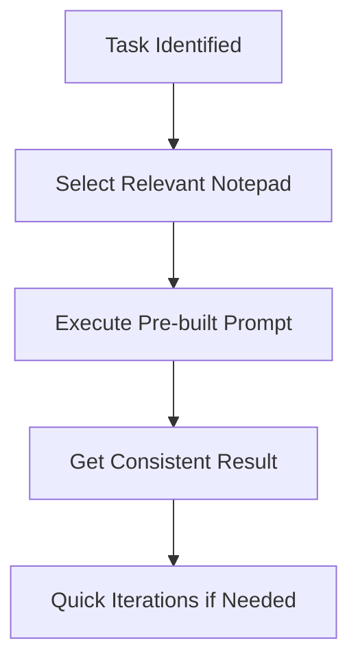
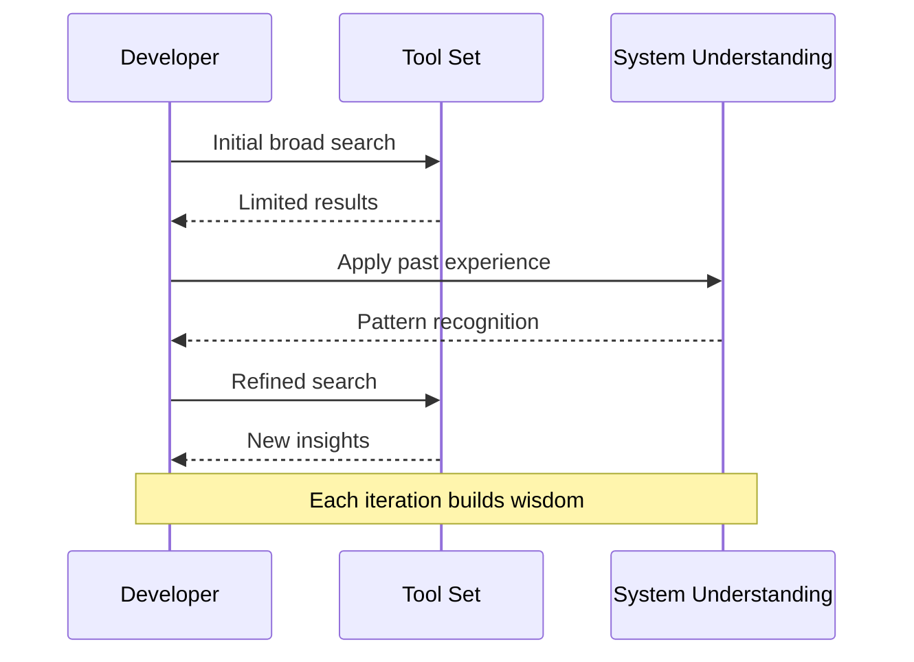
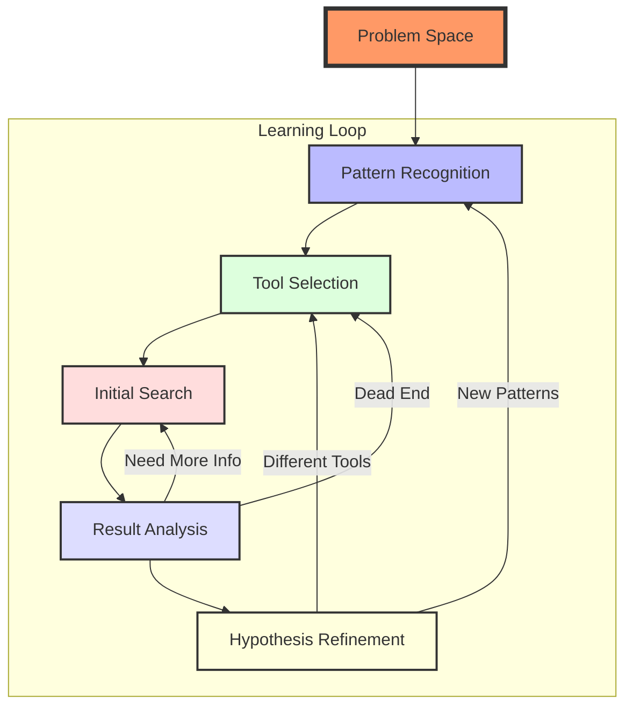

> _A note from Doug - January 21st, 2025_
>
> The work you're about to read is distilled from 15 years of getting my hands dirty in tech - debugging, building, and occasionally breaking things. While the polished words you see here were shaped with the help of an LLM (because let's face it, my raw thoughts are a beautiful mess), every insight, every "aha" moment, and every hard-learned lesson comes from real experience - including a particularly intense deep-dive Tuesday that sparked this whole thing.
>
> Yes, it probably reads a bit "ChatGPT-ish" - that's the current limitation of the tech. But I made a choice: share these insights now, letting AI help clean up my stream-of-consciousness rambling, or wait until I found time to manually craft every word (spoiler: that would never happen). I believe that in the near future, we'll have tools that can capture our authentic voices while maintaining clarity. For now, though, I hope you'll forgive the occasional artificial aftertaste and focus on the very real experiences and insights I'm trying to share.
>
> _- Doug_

# Deep Dive: Hacking Cursor's Notepad System

> Yes - This is a technical exploration of Cursor IDE's notepad storage system and how I built tools to enhance it, but it's also a look at how a professional problem solver works.

## Table of Contents

- [Introduction](#introduction)
- [The Problem](#the-problem)
- [A Word on Problem-Solving](#a-word-on-problem-solving)
- [Understanding Cursor's Architecture](#understanding-cursors-architecture)
- [The Investigation](#the-investigation)
- [Technical Implementation](#technical-implementation)
- [Building the Solution](#building-the-solution)
- [Future Improvements](#future-improvements)

## Introduction

This isn't how I thought I'd spend my Tuesday morning, but after renaming a project folder and losing all my Cursor settings, here I am, making the system change instead of myself.

### What are Cursor Notepads?

Cursor Notepads are an incredible feature that enhance output quality and let you harness literal LLM magic. They're not just text files – they're interactive AI prompts, code snippets, and project documentation that evolve with your workflow. I rarely use the AI composer without one of my many notepad templates guiding the conversation.

But there's a catch: these powerful tools are locked to individual workspaces. Create a new project? Start from scratch. Rename a folder? Wave goodbye to your carefully crafted prompts. This isn't a great workflow, so I decided to change it.

### The Hidden Power User Feature

Here's the thing - most people don't even know Cursor Notepads exist. They're tucked away in that bottom-left corner, and if you haven't created any, it's just an empty space with a lonely "Create New" button. But as a power user, I can tell you: this is possibly the most underrated feature in Cursor's arsenal.

> 🚀 **Power User Insight**: Think of Notepads as your personal coding accelerators. Each one is a pre-built prompt that can save you minutes of typing and thinking.

I've built up a massive library of notepads, each serving a specific purpose:

| Notepad Type | Purpose | Example |
|--------------|---------|----------|
| Project Patterns | Document and enforce architectural decisions | "Create new component following our atomic design system" |
| Documentation Templates | Standardize documentation | "Generate API endpoint documentation with examples" |
| Git Workflows | Automate common git operations | "Create feature branch and initial commit" |
| Feature Flags | Manage feature rollouts | "Add new feature flag with migration plan" |
| TDD Workflows | Guide test-driven development | "Red-Green-Refactor cycle for new feature" |
| Code Analysis | Find potential impacts | "Use grep to find all usages of deprecated API" |

> 💡 **Productivity Hack**: Chain 3-4 notepads together in a sequence to rapidly complete complex tasks that would normally take 15-20 minutes of prompt crafting.

#### Why They're Game-Changing

1. **Extended Runway**: Instead of spending 5-10 minutes crafting the perfect prompt, I can reference an existing notepad and get moving immediately.

2. **Consistent Quality**: Each notepad has been refined over time to produce exactly the output format I need.

3. **Guardrails Built-In**: My notepads include specific constraints and requirements, preventing the AI from going off-track.

4. **Workflow Acceleration**: What used to take multiple prompt iterations now happens in one shot.



> 🎯 **Getting Started Tip**: Start small. Create a notepad for something simple like `git add . && git commit -m "your message"`. Once you see how much time it saves, you'll naturally expand to more complex scenarios.

Yes, each notepad interaction costs LLM credits. But the time saved and consistency gained make it one of the most valuable investments in your development workflow. This is how I maintain high velocity while ensuring quality - it's not about typing faster, it's about leveraging tools smarter.

## The Problem

It started with a simple folder rename. One morning, I opened my newly renamed project in Cursor IDE, and all my carefully crafted notepads and settings were gone. Not just any notepads – these were my collection of AI prompts, code snippets, and project documentation that I'd been refining for near on months, now - inheriting the best from previous projects and refining them over a very long career of FAFO-induced stupor.

The original discussion on [Cursor's forum](https://forum.cursor.com/t/where-are-notepads-stored/18659/10) showed I wasn't alone. Many developers were looking for ways to back up and manage their notepads, but there were no solutions available.

## A Word on Problem-Solving

Like all the best rabbit holes, this one started with a hunch. I knew I wanted to do the thing, and nobody had done it before, so I had the choice of waiting for someone else, or to be the one that did it.

A good problem is a rare but powerful thought. It's much like good marketing. A good problem:

→ Sets the stage with just enough detail to nudge your thoughts in the right direction.

→ Lets your own inquisitive thoughts fill in the gaps and make your own journey.

→ Sees you, the protagonist, arrive at the gates of the dungeon, armed not only with your ambition and a poorly scribbled map from previous travelers, but with all the gear you accumulated from (un)successful runs in your career.

→ The most persuasive problems are the ones that get in your future self's head. They manifest themselves not just as a bug to crush or a decision to make, but as an opportunity that lights a fire under your ass to do the hard work.

As someone with an overindex of experience solving incredibly niche problems that get in the way of progress - building this tool is one of those exercises.

Cursor is built on VSCode's architecture, which means it's an Electron application. This gives us some immediate insights:

1. **Storage Location**: Like most Electron apps, user data is stored in the AppData directory:

   Windows:

   ```
   %AppData%/Roaming/Cursor/User/workspaceStorage/{workspace_id}/state.vscdb
   ```

   macOS:

   ```
   ~/Library/Application Support/Cursor/User/workspaceStorage/{workspace_id}/state.vscdb
   ```

2. **Data Structure**:
   - SQLite database (`state.vscdb`)
   - Two key tables: `ItemTable` and `cursorDiskKV`
   - Notepad data stored under two keys:
     - `notepad.reactiveStorageId`
     - `notepadData`


## The Investigation

### 1. Starting Knowledge

First, let's break down what I know about Cursor:


The key insights:

- Cursor is a VSCode fork
- VSCode is Electron-based
- Electron apps follow standard storage patterns
- Windows apps store user data in `%AppData%`

### 2. Initial Location Search

Armed with this knowledge, my first step was obvious:

```bash
# Windows
cd %AppData%/Roaming/Cursor/

# Look familiar? It should - it's identical to VSCode's structure
User/
├── globalStorage/     # Global application data
└── workspaceStorage/ # Per-workspace settings
    └── {uuid}/      # Individual workspace data
```

### 3. Data Discovery Process

This is where my real detective work began. My process:

1. **Quick File Analysis**
   - Drop files into text editor
   - Scan JSON files (mostly configuration)
   - Check `.txt` files (logs and metadata)
   - Note any `.db` or `.sqlite` files

2. **Common Storage Patterns**

   ```bash
   # Look for database files
   find . -type f -name "*.db" -o -name "*.sqlite" -o -name "*.vscdb"
   
   # Check for JSON storage
   find . -type f -name "state.json" -o -name "storage.json"
   
   # Scan log files for clues
   find . -type f -name "*.log"
   ```

3. **Grep for Notepad References**

   ```bash
   grep -r "notepad" .
   ```

   I found references in:
   - Log files (view initialization)
   - Binary files (`.code` files)
   - SQLite databases

Here's where experience becomes invaluable. When I was younger, I might have stopped at manual file inspection or given up after a quick Google search yielded nothing. But years of diving into similar problems taught me something crucial: your toolset isn't just about knowing commands – it's about understanding patterns and possibilities.

> 💡 **Pro Tip**: Failed searches aren't dead ends – they're breadcrumbs telling you to adjust your assumptions. Each "no match found" is valuable data pointing you in a new direction.

Take `grep`, for instance. I knew from past projects that manually scanning through an application's directory would miss countless references buried in logs and binary files. But more importantly, I knew that even "failed" searches tell a story. When `grep` didn't find what I expected in certain files, it wasn't a dead end – it was a breadcrumb telling me to adjust my assumptions.



| Experience Level | Approach | Outcome | Wisdom Applied |
|-----------------|----------|----------|----------------|
| Novice | Quick Google → Give up | "It's impossible" |
| Intermediate | Try known tools → Ask for help | "Maybe someone knows" |
| Senior | Pattern matching → Systematic investigation | "Every problem is solvable" |
| Expert | Is this the right problem to solve? | Valued consulting power |

This is the kind of wisdom that only comes from doing the hard work repeatedly, and making the mistakes associated with them. Each stack I've worked with, each system I've debugged, has added to my mental model of how systems typically behave.

> 🔍 **Investigation Wisdom**: Start with a diverse toolset. Each tool isn't just for finding what you want – it's for telling you where NOT to look.

Consider these technology parallels:

- **VSCode's architecture?** I've dicked around with Electron apps before
- **Database storage?** I've built similar systems from my days in tutorial hell through to modern infra
- **File permissions?** Classic system patterns used everywhere, with a slightly different flavour.

These experiences don't just give you commands to run – they give you intuition about where to look and what questions to ask.



> 🔄 **Process Insight**: Problem-solving isn't linear - it's a series of feedback loops where each "failure" informs your next approach.

> 🎯 **Career Insight**: The real power isn't in knowing tools exist – it's in understanding why you'd reach for each one at different stages of problem-solving.

### The Problem-Solving Matrix

| Stage | Tool Example | Purpose | Wisdom Applied |
|-------|--------------|---------|----------------|
| Initial Survey | `ls`, `tree` | Get lay of the land | File organization patterns |
| Deep Search | `grep`, `find` | Uncover connections | Data storage conventions |
| Validation | SQLite browser | Test hypotheses | Database access patterns |
| Solution Design | Past experience | Pattern matching | System architecture knowledge |

This is what separates seasoned problem-solving from surface-level debugging. It's not about following a predetermined path; it's about recognizing patterns, making educated guesses, and using your tools to validate or invalidate your hypotheses.

> 🌟 **Key Learning**: When you've done this enough times, you start seeing constellations instead of just stars – the connections between problems and solutions become clearer.

Too often, I see developers hit a wall after their initial Google search comes up empty. "No one's written about this specific problem," they say, "so it must be impossible." But that's exactly where the interesting work begins. Every unique problem is just a combination of patterns you've seen before, viewed from a different angle.

In this case, my experience with database systems, file permissions, and application storage patterns all came together. The `grep` search wasn't just about finding text – it was about testing hypotheses and letting each result guide my next move. This is the kind of wisdom that transforms a collection of tools into a problem-solving framework.

### 4. Database Investigation

The breakthrough came when I found `state.vscdb`:

```sql
-- First attempt: Look for notepad-related keys
SELECT * FROM ItemTable 
WHERE key LIKE '%notepad%';

-- Found my treasure:
-- 1. notepad.reactiveStorageId
-- 2. notepadData
```

### 5. The "Aha" Moment

Here's where it got interesting. After finding the data:

1. Made an edit to a notepad in the database
2. Opened Cursor... and all notepads disappeared
3. **Key Learning**: File permissions matter
   - Database locked by viewer
   - Cursor couldn't access it
   - Close viewer, notepads return


This investigation led to some important principles for my solution:

1. Always check file permissions
2. Implement proper database locking
3. Handle connection errors gracefully
4. Maintain backups (thank you, `.vscdb.backup`)

## Technical Implementation

### 1. Workspace Structure

Here's how I structured the workspace data:

```typescript
interface WorkspaceInfo {
  id: string;              // Workspace UUID
  folderPath: string;      // Absolute path
  dbPath: string;          // Path to state.vscdb
}
```

### 2. Notepad Data Model

I designed the notepad data model to capture all essential information:

```typescript
interface NotepadInfo {
  id: string;
  name: string;
  text: string;
  createdAt: number;
  context: NotepadContext;
  // ... additional metadata
}
```

### 3. Storage Access

I implemented a clean interface for database operations:

```typescript
class Workspace {
  async get<T>(key: string): Promise<T | null> {
    // Access SQLite database
  }

  async set<T>(key: string, value: T): Promise<void> {
    // Update database
  }
}
```

## Building the Solution

### 1. Core Features

I focused on implementing these essential features:

- Workspace detection and management
- SQLite database access
- Notepad CRUD operations
- Backup and restore functionality

### 2. Safety Considerations

To ensure reliability, I implemented:

- Automatic database backups
- File permission handling
- Cursor process detection

### 3. User Interface

Here's an example of how you can create a new notepad:

```typescript
// Example: Creating a new notepad
const notepad = await notepadManager.createNotepad({
  name: "My Notepad",
  text: "Initial content"
});
```

## Future Improvements

1. **Cross-Platform Support**
   - macOS: `~/Library/Application Support/Cursor`
   - Linux: `~/.config/Cursor`

2. **Enhanced Features**
   I'm planning to add:
   - Template management
   - Cloud sync
   - Workspace migration tools

3. **Community Contributions**
   I'd love to see:
   - Template sharing
   - Plugin system
   - Custom storage backends

## Resources

If you want to learn more, check out:

- [Original Forum Discussion](https://forum.cursor.com/t/where-are-notepads-stored/18659/10)
- [SQLite Documentation](https://www.sqlite.org/docs.html)
- [Electron Storage Best Practices](https://www.electronjs.org/docs/latest/api/app#appgetpathname)
